# Lab 6 : Translate Text

## Lab overview
**Azure AI Translator** is a service that enables you to translate text between languages.

For example, suppose a travel agency wants to examine hotel reviews that have been submitted to the company's web site, standardizing on English as the language that is used for analysis. By using Azure AI Translator, they can determine the language each review is written in, and if it is not already English, translate it from whatever source language it was written in into English.

### Task 1: Clone the repo into your Azure Cloud Shell

1. In the [Azure portal](https://portal.azure.com?azure-portal=true), select the **[>_]** (*Cloud Shell*) button at the top of the page to the right of the search box. This opens a Cloud Shell pane at the bottom of the portal. 

    

1. The first time you open the Cloud Shell, you may be prompted to choose the type of shell you want to use (*Bash* or *PowerShell*). Select **PowerShell**. If you don't see this option, skip the step.

    

1. If you are prompted to create storage for your Cloud Shell, ensure your subscription is selected and click on **show advanced settings**.
  
   
   
1.  Please make sure you have selected your resource group **Ai-102-<inject key="DeploymentID" enableCopy="false"/> (1)** and enter **blob<inject key="DeploymentID" enableCopy="false"/> (2)** for the **Storage account name** and enter **blobfileshare<inject key="DeploymentID" enableCopy="false"/> (3)** For the **File share name**, then click on **Create Storage (4)**.

    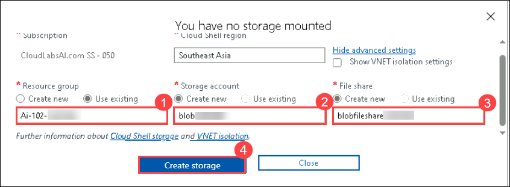

1. Make sure the type of shell indicated on the top left of the Cloud Shell pane is switched to *PowerShell*. If it is *Bash*, switch to *PowerShell* by using the drop-down menu.

    

1. Wait for PowerShell to start. You should see the following screen in the Azure portal:  

    

1. Once the terminal starts, run the following commands to download a copy of the repo into your Cloud Shell:

    ```bash
    rm -r azure-ai-eng -f
    git clone https://github.com/MicrosoftLearning/AI-102-AIEngineer azure-ai-eng
    ```

     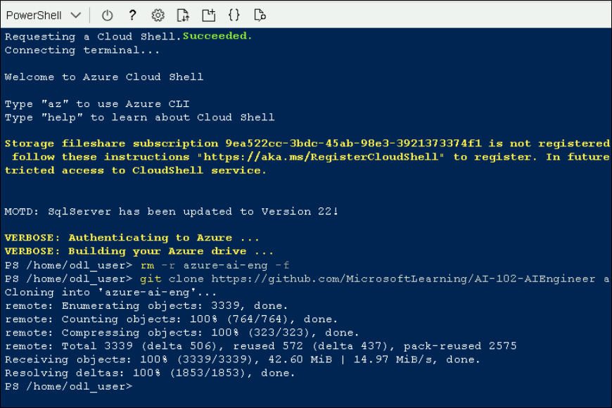

1. The files have been downloaded into a folder called **azure-ai-eng**. Let's use the Cloud Shell Code editor to open the appropriate folder by running:

    ```bash
    cd azure-ai-eng/06-translate-text
    ```
1. Open the built-in code editor, and observe the text files in the `text-analysis` folder. Use the following command to open the lab files in the code editor.

    ```bash
    code .
    ```
     

### Task 2: Provision an Azure AI Translator resource

1. Open the Azure portal at `https://portal.azure.com`, and sign in using the Microsoft account associated with your Azure subscription.

1. In the Azure Portal click the **&#65291;Create a resource** button.

     
   
1. In the Marketplace page search for **azure ai Services** and Select **azure ai Services** 
   
   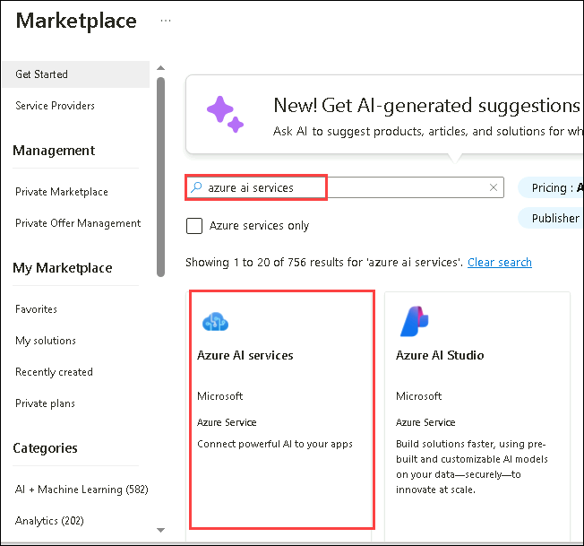
     
1. On Cognitive Services Page Click on **Create**. 
     
     

1. Create a resource with the following settings:

    - **Subscription (1)**: Use default Subscription
    - **Resource group (2)**: Ai-102<inject key="DeploymentID" enableCopy="false"/> 
    - **Region (3)**: **<inject key="location" enableCopy="false"/>**
    - **Name (4)**: aiservices-<inject key="DeploymentID" enableCopy="false"/> 
    - **Pricing tier (5)**: Standard S0
1. Select **Create + review (6)**.

   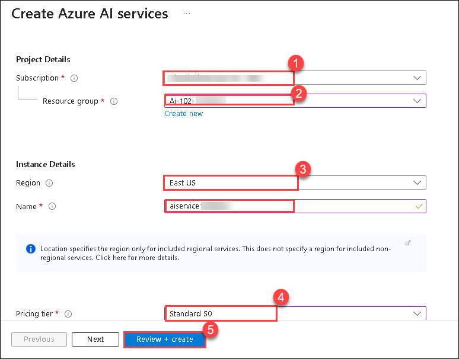

1. Select **Create**.

   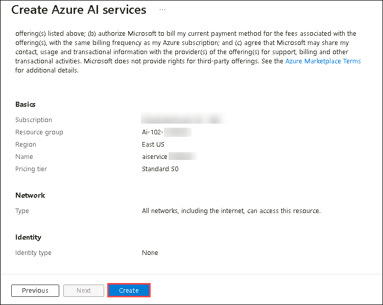

1. Wait for deployment to complete, and once deployment completed click on **Go to resource**.

   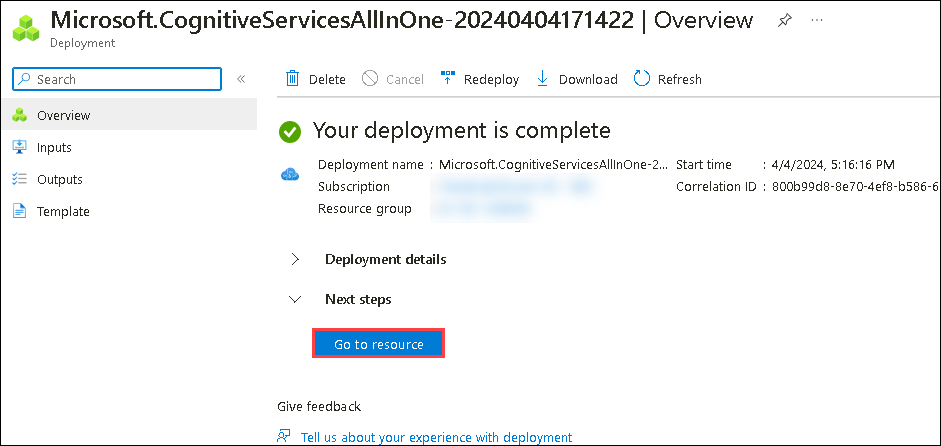

1. When the resource has been deployed, go to it and view its **Keys and Endpoint** page. You will need one of the **keys and the location** in which the service is provisioned from this page in the next procedure.

   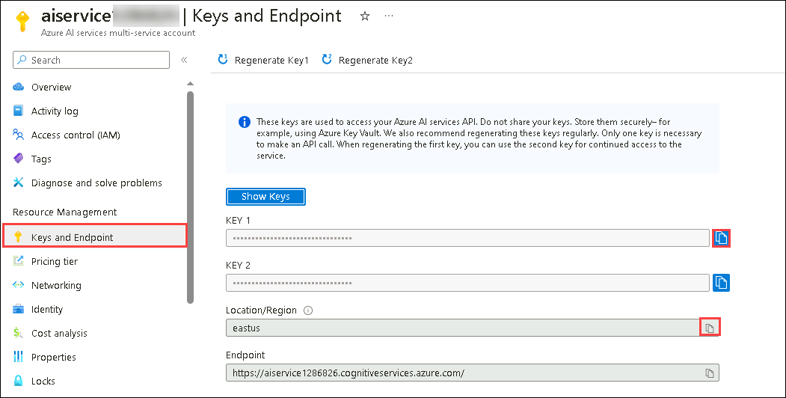

### Task 3: Prepare to use Azure AI Translator

In this exercise, you'll complete a partially implemented client application that uses the Azure AI Translator REST API to translate hotel reviews.

> [!NOTE]
> You can choose to use the API from either **C#** or **Python**. In the steps below, perform the actions appropriate for your preferred language.

1. In your Cloud Shell editor, expand the **06-translate-text** folder, and then the **C-Sharp** > **text-translation** or **Python**  > **text-translation** folder depending on your language preference.
1. View the contents of the **text-translation** folder, and note that it contains a file for configuration settings:
    - **C#**: appsettings.json
    - **Python**: .env

    Open the configuration file and update the configuration values it contains to include an authentication **key** for your Azure AI Translator resource, and the **location** where it is deployed (<u>not</u> the endpoint) - you should copy both of these from the **Keys and Endpoint** page for your Azure AI Translator resource. Save your changes ny pressing **CTRL + S**.
1. Note that the **text-translation** folder contains a code file for the client application:

    - **C#**: Program.cs
    - **Python**: text-translation.py

    Open the code file and examine the code it contains.

1. In the **Main** function, note that code to load the Azure AI Translator key and region from the configuration file has already been provided. The endpoint for the  service is also specified in your code.

1. In your terminal enter the following commands to point the terminal to the appropriate folder and do a test run:

    **C#**

    ```bash
    cd azure-ai-eng/06-translate-text/C-Sharp/text-translation
    ```

    **C#**

    ```bash
    dotnet run
    ```

     

    **Python**

    ```bash
    cd azure-ai-eng/06-translate-text/Python/text-translation
    ```

    **Python**

    ```bash
    pip install python-dotenv
    ```
    

    **Python**

    ```bash
    python text-translation.py
    ```
    

1. Observe the output as the code should run without error, displaying the contents of each review text file in the **reviews** folder. The application currently doesn't make use of Azure AI Translator. We'll fix that in the next procedure.

## Detect language

Azure AI Translator can automatically detect the source language of text to be translated, but it also enables you to explicitly detect the language in which text is written.

1. In your code file, find the **GetLanguage** function, which currently returns "en" for all text values.
 
    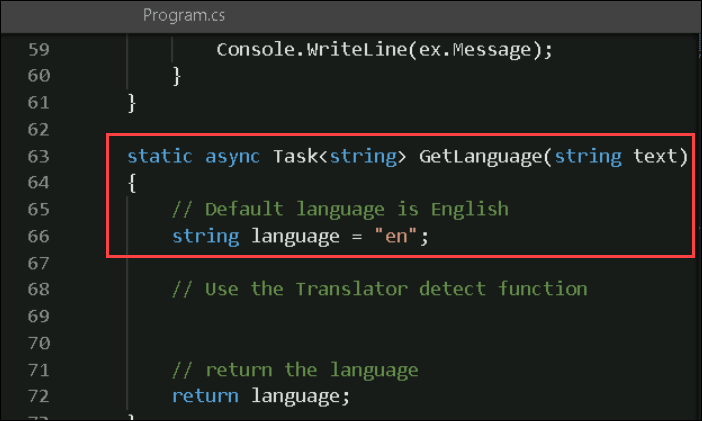

    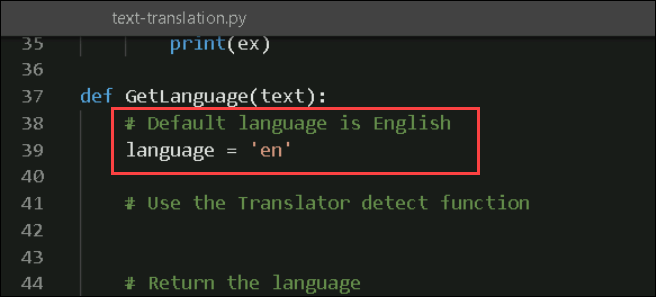

1. In the **GetLanguage** function, under the comment **Use the Azure AI Translator detect function**, add the following code to use the Azure AI Translator's REST API to detect the language of the specified text, being careful not to replace the code at the end of the function that returns the language:

    **C#**

    ```csharp
    // Use the Azure AI Translator detect function
    object[] body = new object[] { new { Text = text } };
    var requestBody = JsonConvert.SerializeObject(body);
    using (var client = new HttpClient())
    {
        using (var request = new HttpRequestMessage())
        {
            // Build the request
            string path = "/detect?api-version=3.0";
            request.Method = HttpMethod.Post;
            request.RequestUri = new Uri(translatorEndpoint + path);
            request.Content = new StringContent(requestBody, Encoding.UTF8, "application/json");
            request.Headers.Add("Ocp-Apim-Subscription-Key", cogSvcKey);
            request.Headers.Add("Ocp-Apim-Subscription-Region", cogSvcRegion);
    
            // Send the request and get response
            HttpResponseMessage response = await client.SendAsync(request).ConfigureAwait(false);
            // Read response as a string
            string responseContent = await response.Content.ReadAsStringAsync();
    
            // Parse JSON array and get language
            JArray jsonResponse = JArray.Parse(responseContent);
            language = (string)jsonResponse[0]["language"]; 
        }
    }
    ```
   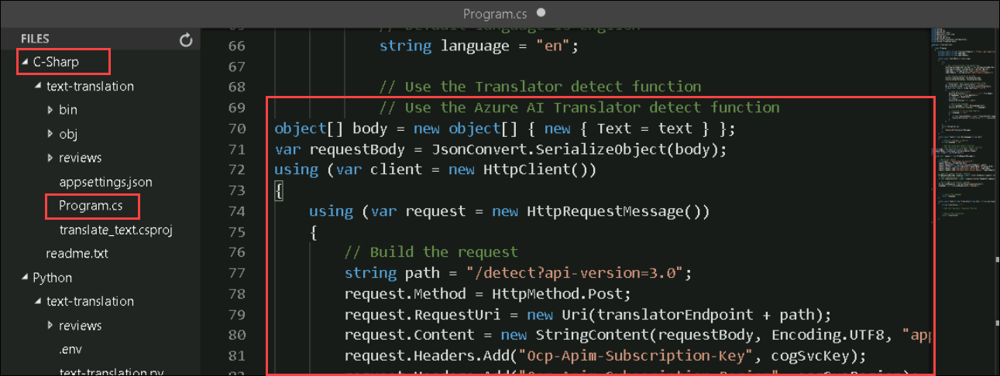

    **Python**

    ```python
    # Use the Azure AI Translator detect function
    path = '/detect'
    url = translator_endpoint + path
    
    # Build the request
    params = {
        'api-version': '3.0'
    }
    
    headers = {
    'Ocp-Apim-Subscription-Key': cog_key,
    'Ocp-Apim-Subscription-Region': cog_region,
    'Content-type': 'application/json'
    }
    
    body = [{
        'text': text
    }]
    
    # Send the request and get response
    request = requests.post(url, params=params, headers=headers, json=body)
    response = request.json()
    
    # Parse JSON array and get language
    language = response[0]["language"]
    ```
    
   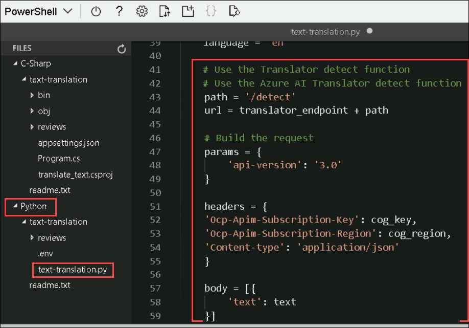
    
1. Save your changes by pressing **CTRL+S** and  and enter the following command in the terminal to run the program:

    **C#**

    ```bash
    dotnet run
    ```
   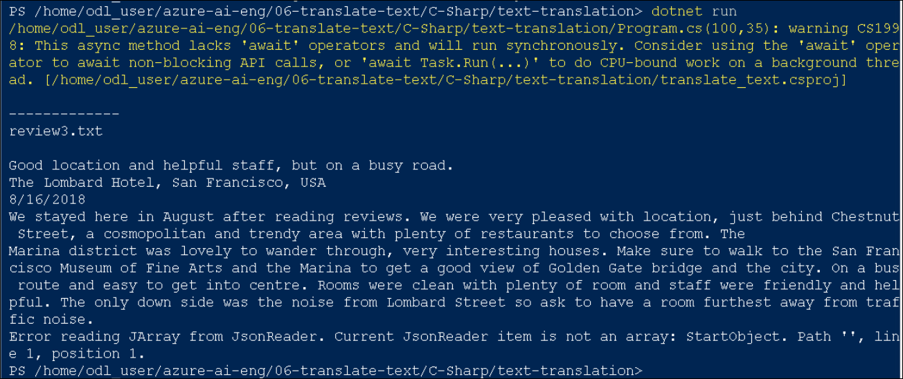

    **Python**

    ```bash
    python text-translation.py
    ```

   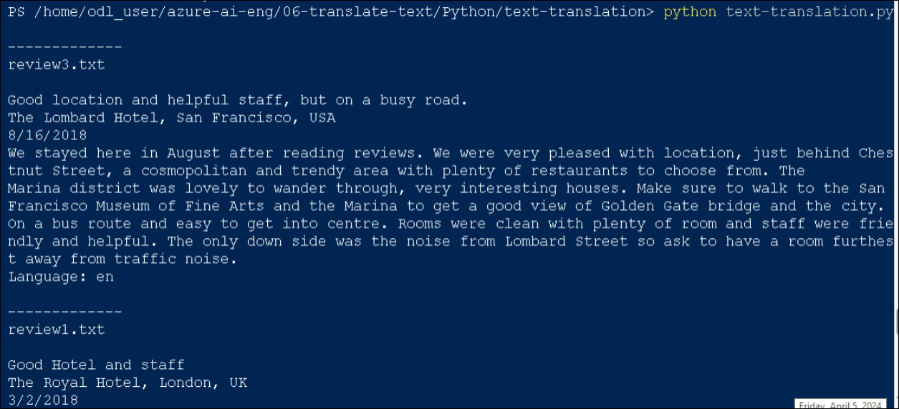

1. Observe the output, noting that this time the language for each review is identified.

### Task 4: Translate text

Now that your application can determine the language in which reviews are written, you can use Azure AI Translator to translate any non-English reviews into English.

1. In your code file, find the **Translate** function, which currently returns and empty string for all text values.
1. In the **Translate** function, under the comment **Use the Azure AI Translator translate function**, add the following code to use the Azure AI Translator's REST API to translate the specified text from its source language into English, being careful not to replace the code at the end of the function that returns the translation:

   **C#**

   ```csharp
        // Use the Azure AI Translator translate function
        object[] body = new object[] { new { Text = text } };
        var requestBody = JsonConvert.SerializeObject(body);
        using (var client = new HttpClient())
        {
            using (var request = new HttpRequestMessage())
            {
                // Build the request
                string path = "/translate?api-version=3.0&from=" + sourceLanguage + "&to=en" ;
                request.Method = HttpMethod.Post;
                request.RequestUri = new Uri(translatorEndpoint + path);
                request.Content = new StringContent(requestBody, Encoding.UTF8, "application/json");
                request.Headers.Add("Ocp-Apim-Subscription-Key", cogSvcKey);
                request.Headers.Add("Ocp-Apim-Subscription-Region", cogSvcRegion);

                // Send the request and get response
                HttpResponseMessage response = await client.SendAsync(request).ConfigureAwait(false);
                // Read response as a string
                string responseContent = await response.Content.ReadAsStringAsync();

                // Parse JSON array and get translation
                JArray jsonResponse = JArray.Parse(responseContent);
                translation = (string)jsonResponse[0]["translations"][0]["text"];  
            }
        }
     ```
     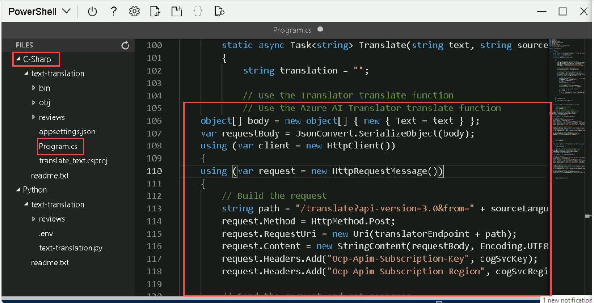

   **Python**
 
   ```python
    # Use the Azure AI Translator translate function
    path = '/translate'
    url = translator_endpoint + path

    # Build the request
    params = {
        'api-version': '3.0',
        'from': source_language,
        'to': ['en']
    }

    headers = {
        'Ocp-Apim-Subscription-Key': cog_key,
        'Ocp-Apim-Subscription-Region': cog_region,
        'Content-type': 'application/json'
    }

    body = [{
        'text': text
    }]

    # Send the request and get response
    request = requests.post(url, params=params, headers=headers, json=body)
    response = request.json()

    # Parse JSON array and get translation
    translation = response[0]["translations"][0]["text"]
   ```

   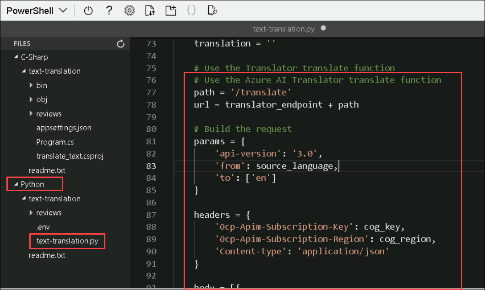

1. Save your changes and enter the following command to run the program:

   **C#**

    ```bash
    dotnet run
    ```
    

    **Python**

    ```bash
    python text-translation.py
    ```
   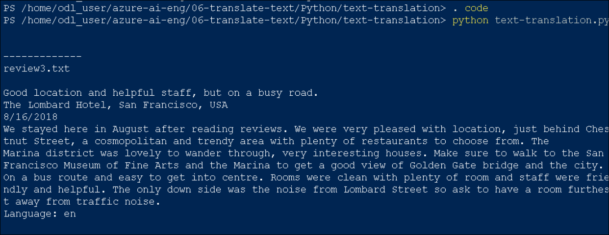

1. Observe the output, noting that non-English reviews are translated into English.

### Learn more

For more information about using **Azure AI Translator**, see the [Azure AI Translator documentation](/azure/ai-services/translator/).
