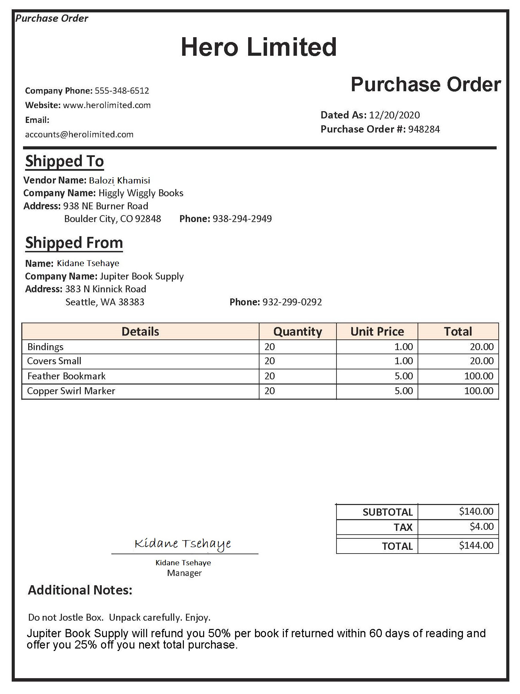
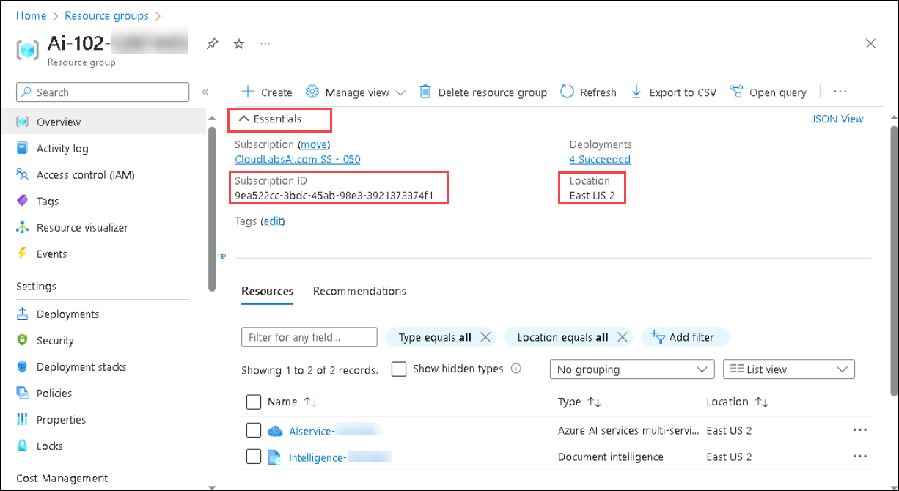

# Exercise 2 : Extract Data from Forms 

## Lab scenario

Suppose a company needs to automate a data entry process. Currently an employee might manually read a purchase order and enter the data into a database. You want to build a model that will use machine learning  to read the form and produce structured data that can be used to automatically update a database.

**Form Recognizer** is a cognitive service that enables users to build automated data processing software. This software can extract text, key/value pairs, and tables from form documents using optical character recognition (OCR). Form Recognizer has pre-built models for recognizing invoices, receipts, and business cards. The service also provides the capability to train custom models. In this exercise, we will focus on building custom models.

## Objectives

In this lab, you will complete the following tasks:

 + Task 1: Open the cloned folder in Visual Studio Code.
 + Task 2: Create a Azure AI Document Intelligence resource
 + Task 3: Gather documents for training
 + Task 4: Train a model using the Document Intelligence SDK
 + Task 5: Test your custom Document Intelligence model 

## Task 1: Open the cloned folder in Visual Studio Code

1.  Start Visual Studio Code (the program icon is pinned to the bottom taskbar).

     

2.  Open a file, From the top-left options, Click on **file->Open Folder** and navigate to **C:\LabFiles\AI-102-AIEngineer-master**.

    **Note:** You may be prompted to complete a 2-minute survey. Go ahead and select **No, thanks**. You may need to do this more than once.

3.  Wait while additional files are installed to support the C# code projects in the repo.


## Task 2: Create a Azure AI Document Intelligence resource

To use the Form Recognizer service, you need a Form Recognizer resource in your Azure subscription. You'll use the Azure portal to create a resource.

1.  Open the Azure portal at `https://portal.azure.com`, and sign in using the Microsoft account associated with your Azure subscription.

2. Select the **&#65291;Create a resource** button, search for *Document intelligence*, select **Document intelligence(form recogniser)** and then select **Create**. Provide the following settings:
    - **Subscription**: *Your Azure subscription*
    - **Resource group**: *Ai-102-<inject key="DeploymentID" enableCopy="false" /></inject>*.
    - **Region**: **<inject key="Region" enableCopy="false"/>**.
    - **Name**: **Intelligence-<inject key="DeploymentID" enableCopy="false" /></inject>**
    - **Pricing tier**: S0

    > **Note**: If you already have an F0 form recognizer service in your subscription, select **S0** for this one.

1. Select **Review + create** and **Create**.

1. Wait for the deployment to complete. Once the deployment is successful, click on **Go to resources** to view the deployment details.
1. In the left navigation pane, under the **Resource Management** section, choose **Keys and Endpoint**. Make sure to note down the Keys and Endpoint values in notepad. You'll require the endpoint and one of the keys from this page for the subsequent procedure.

     > **Congratulations** on completing the task! Now, it's time to validate it. Here are the steps:
     > - Navigate to the Lab Validation Page, from the upper right corner in the lab guide section.
     > - Hit the Validate button for the corresponding task. If you receive a success message, you can proceed to the next task. 
     > - If not, carefully read the error message and retry the step, following the instructions in the lab guide.
     > - If you need any assistance, please contact us at labs-support@spektrasystems.com. We are available 24/7 to help you out.

## Task 3: Gather documents for training

  

You'll use the sample forms from the **21-custom-form/sample-forms** folder in this repo, which contain all the files you'll need to train and test a model.

1. In Visual Studio Code, in the **21-custom-form** folder,  expand the **sample-forms** folder. Notice there are files ending in **.json** and **.jpg** in the folder.

    You will use the **.jpg** files to train your model.  

    The **.json** files have been generated for you and contain label information. The files will be uploaded into your blob storage container alongside the forms. 

2. Return to the Azure portal at [https://portal.azure.com](https://portal.azure.com).

3. View the **Resource group** in which you created the Document Intelligence resource previously.

4. On the **Overview** page for your resource group, note the **Subscription ID** and **Location**. You will need these values, along with your **resource group** name in subsequent steps. Select the Essentials option if you don't see the above options.

   

5. In Visual Studio Code, in the Explorer pane, right-click the the **21-custom-form** folder and select **Open in Integrated Terminal**.

6. In the terminal pane, enter the following command to establish an authenticated connection to your Azure subscription.
    
     ```
     az login --output none
     ```

7. When prompted, sign into your Azure subscription. Then return to Visual Studio Code and wait for the sign-in process to complete.

8. Run the following command to list Azure locations.

     ```
     az account list-locations -o table
     ```

9. In the output, find the **Name** value that corresponds with the location of your resource group  **<inject key="Region" enableCopy="false"/>**.

    > **Important**: Record the **Name** value and use it in Step 12.

10. In the Explorer pane, in the **21-custom-form** folder, select **setup.cmd**. You will use this batch script to run the Azure command line interface (CLI) commands required to create the other Azure resources you need.

11. In the **setup.cmd** script, review the **rem** commands. These comments outline the program the script will run. The program will: 
    - Create a storage account in your Azure resource group
    - Upload files from your local _sampleforms_ folder to a container called _sampleforms_ in the storage account
    - Print a Shared Access Signature URI

12. Modify the **subscription_id**, **resource_group**, and **location** variable declarations with the appropriate values for the subscription, resource group, and location name which you noted in step 9. 
Then **save** your changes.

    Leave the **expiry_date** variable as it is for the exercise. This variable is used when generating the Shared Access Signature (SAS) URI. In practice, you will want to set an appropriate expiry date for your SAS. You can learn more about SAS [here](https://docs.microsoft.com/azure/storage/common/storage-sas-overview#how-a-shared-access-signature-works).  

13. In the terminal for the **21-custom-form** folder, enter the following command to run the script:

     ```
     .\setup
     ```

14. When the script completes, review the displayed output and note your Azure resource's SAS URI.

> **Important**: Before moving on, paste the SAS URI somewhere you will be able to retrieve it again later (for example, in a new text file in Visual Studio Code).

15. In the Azure portal, refresh the resource group and verify that it contains the Azure Storage account just created. Open the storage account and in the pane on the left, select **Storage Browser**. Then in Storage Browser, expand **BLOB CONTAINERS** and select the **sampleforms** container to verify that the files have been uploaded from your local **21-custom-form/sample-forms** folder.

## Task 4: Train a model using the Document Intelligence SDK

Now you will train a model using the **.jpg** and **.json** files.

1. In Visual Studio Code, in the **21-custom-form/sample-forms** folder, open **fields.json** and review the JSON document it contains. This file defines the fields that you will train a model to extract from the forms.
2. Open **Form_1.jpg.labels.json** and review the JSON it contains. This file identifies the location and values for named fields in the **Form_1.jpg** training document.
3. Open **Form_1.jpg.ocr.json** and review the JSON it contains. This file contains a JSOn representation of the text layout of **Form_1.jpg**, including the location of all text areas found in the form.

    *The field information files have been provided for you in this exercise. For your own projects, you can create these files using the [Document Intelligence Studio](https://formrecognizer.appliedai.azure.com/studio). As you use the tool, your field information files are automatically created and stored in your connected storage account.*

4. In Visual Studio Code, in the **21-custom-form** folder, expand the **C-Sharp** folder depending on your language preference.
5. Right-click the **train-model** folder and open an integrated terminal.

6. Install the Document Intelligence package by running the appropriate command for your language preference:

**C#**

```
dotnet add package Azure.AI.FormRecognizer --version 3.0.0 
```

7. View the contents of the **train-model** folder, and note that it contains a file for configuration settings:
    - **C#**: appsettings.json

8. Edit the configuration file, modifying the settings to reflect:
    - The **endpoint** for your Document Intelligence resource.
    - A **key** for your Document Intelligence resource.
    - The **SAS URI** for your blob container. **Save** your changes.

9. Note that the **train-model** folder contains a code file for the client application:

    - **C#**: Program.cs

    Open the code file and review the code it contains, noting the following details:
    - Namespaces from the package you installed are imported
    - The **Main** function retrieves the configuration settings, and uses the key and endpoint to create an authenticated **Client**.
    - The code uses the the training client to train a model using the images in your blob storage container, which is accessed using the SAS URI you generated.

10. In the **train-model** folder, open the code file for the training application:

    - **C#**: Program.cs

11. Return the integrated terminal for the **train-model** folder, and enter the following command to run the program:

     **C#**
     
     ```
     dotnet run
     ```

12. Wait for the program to end, then review the model output.
13. Write down the Model ID in the terminal output. You will need it for the next part of the lab. 

## Task 5: Test your custom Document Intelligence model 

1. In the **21-custom-form** folder, in the subfolder for your preferred language (**C-Sharp**), expand the **test-model** folder.

2. Right-click the **test-model** folder and select **open an integrated terminal**.

3. In the terminal for the **test-model** folder, install the Document Intelligence package by running the appropriate command for your language preference:

     **C#**
     
     ```
     dotnet add package Azure.AI.FormRecognizer --version 3.0.0 
     ```

4. In the same terminal for the **test-model** folder, install the Tabulate library. This will provide your output in a table:

     **C#**
     
     ```
     dotnet add package Tabulate.NET --version 1.0.5
     ```

5. In the **test-model** folder, edit the configuration file (**appsettings.json** or **.env**, depending on your language preference) to add the following values:
    - Your Document Intelligence endpoint.
    - Your Document Intelligence key.
    - The Model ID generated when you trained the model (you can find this by switching the terminal back to the **cmd** console for the **train-model** folder). **Save** your changes.

6. In the **test-model** folder, open the code file for your client application (*Program.cs* for C#) and review the code it contains, noting the following details:
    - Namespaces from the package you installed are imported
    - The **Main** function retrieves the configuration settings, and uses the key and endpoint to create an authenticated **Client**.
    - The client is then used to extract form fields and values from the **test1.jpg** image.
    

7. Return the integrated terminal for the **test-model** folder, and enter the following command to run the program:

     **C#**
     
     ```
     dotnet run
     ```
    
8. View the output and observe how the output for the model provides field names like "CompanyPhoneNumber" and "DatedAs".   

## More information

For more information about the Document Intelligence service, see the [Document Intelligence documentation](https://docs.microsoft.com/azure/cognitive-services/form-recognizer/).

### Review
In this lab, you have completed:

 + Open the cloned folder in Visual Studio Code.
 + Create a Azure AI Document Intelligence resource
 + Gather documents for training
 + Train a model using the Document Intelligence SDK
 + Test your custom Document Intelligence model 

## You have successfully completed the lab
